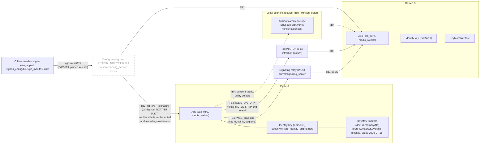
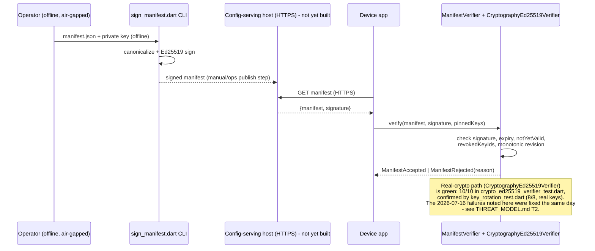

# Data Flow — VoiceCallKit (v2 boundaries; v3 delta lives in the threat model)

Companion to `security/THREAT_MODEL.md`. That document now covers v3 (its
§8 adds TB6-TB8 for the relay, the mesh/carrier lanes, and the broadcast
chain); this file still diagrams the v2 boundaries TB1-TB5 only, and says so
rather than implying it is complete. Contradiction 7, noted 2026-07-31: the
2026-07-27 architecture review said no threat model existed — the file
existed but was v2-only, which is now fixed at the source.

(trust boundaries TB1-TB5 there map
directly to the boundary markers below). This document shows *where data
goes and where it is protected*, not the threats — see the threat model
for the STRIDE analysis and per-item evidence.

Status as reviewed 2026-07-16 on `phase-4/security-identity`: the diagram
shows the designed v2 architecture; nodes not yet built are marked
**(not yet built)** or **(blocked, dated)** inline so this stays a design
document, not a claim that every box is running code today.

## 1. Overview diagram

## 2. Manifest fetch path (detail)

## 3. Trust boundaries and what crosses them

| Boundary | Crosses | Protection | Status |
|---|---|---|---|
| TB1 Device ⇄ signaling service | Envelope: key id, call id, sequence number, message type. No SDP, no media, no address book. | WSS (TLS). App-layer confidentiality of the envelope fields themselves: **not implemented** (see THREAT_MODEL T18) — the signaling server can read these fields today by design (routing metadata), only the TLS channel keeps outside observers out. | Transport: implemented (`server/signaling_server`). App-layer envelope encryption: not yet built. |
| TB2 Device ⇄ config service | Signed manifest (endpoints, regions, min-version, flags). No user identity. | HTTPS transport + Ed25519 signature verification against build-pinned keys; anti-rollback via monotonic revision; last-known-good cache on fetch failure. | Verifier logic: implemented, tested (fakes). Real-crypto backing: landing this wave, 2 tests failing. Live HTTPS host: not yet built. |
| TB3 Device ⇄ TURN/STUN | Relayed SRTP packets (ciphertext only) + short-lived TURN credentials (username/password). | DTLS-SRTP end to end (TURN never sees plaintext media or media keys); credentials are HMAC-based with expiry (`TurnCredentialsIssuer`). | Media crypto: blocked, dated (native WebRTC build, Xcode). Credential minting: implemented, untested (no test file). Credential distribution to a real client per call: not yet built. |
| TB4 Device ⇄ nearby device | Authenticated envelope wrapping session-layer ciphertext; nonce + timestamp. | Off by default; explicit consent; Ed25519 sign/verify; nonce replay cache; staleness window; hop/TTL caps for forwarding. | Protocol logic: implemented, tested (fakes). Real Ed25519 backing (`CryptoEnvelopeSigner`/`Verifier`): implemented, untested, not exported from the package barrel yet. |
| TB5 Device ⇄ push provider | Wake-up signal only (opaque call id, no names/numbers/content). | Fetch-on-wake over TLS; payload minimization by construction. | Not yet built (Phase 8, `docs/EXECUTION_PLAYBOOK.md:133`). |

## 4. Key material locations

| Key material | Current location | Production target |
|---|---|---|
| Device identity private key (Ed25519 seed) | `InMemoryKeyStore` (process lifetime) or `DevFileKeyStore` (plaintext JSON file, dev builds only, never for shipped builds) — `packages/security/lib/src/key_store.dart` | OS Keystore (Android) / Keychain (iOS), hardware-backed where available. **Blocked, dated 2026-07-15**: needs the Flutter app shell to exist before a platform-channel adapter can be written. |
| Manifest signing private key | Operator-held, offline, used only by `packages/signed_config/bin/sign_manifest.dart` in an air-gapped signing step | Same — offline/HSM by design; this does not change with app-shell availability, it's an ops-process control, not a client-code gap. |
| TURN shared secret (`static-auth-secret`) | Configuration value passed to `TurnCredentialsIssuer` (server side only, by contract in the class doc comment) | Must live only on the signaling/TURN-issuing server; the class explicitly documents that shipping it inside a client bundle leaks it to every install. No server-side wiring exists yet to enforce this operationally. |
| Pinned peer identities (TOFU) | In-memory / `SecureKeyValueStore` adapter (interface), exercised in tests via `InMemorySecureKeyValueStore` | Platform secure storage, same blocker as the identity key above. |

## 5. Review cadence

Reviewed alongside `security/THREAT_MODEL.md` at every milestone and
whenever a new component crosses a trust boundary listed above.
